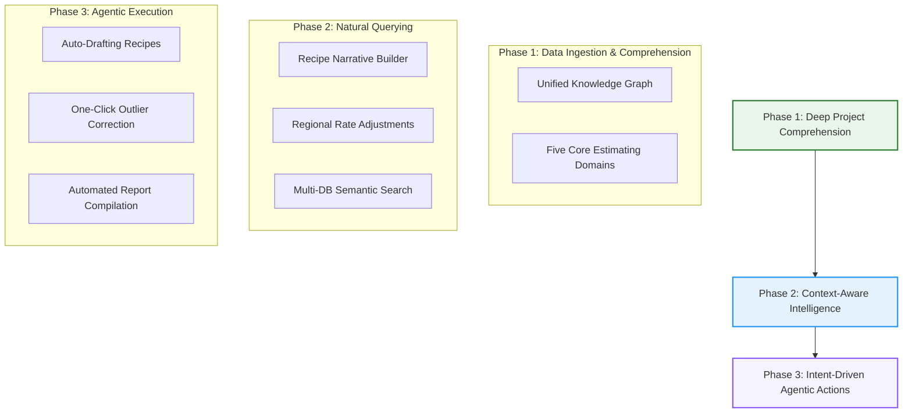

# 🗺️ Estimator Pro AI Copilot: Strategic Roadmap

This document outlines the phased development roadmap for integrating a world-class, context-aware **AI Quantity Surveyor and Estimating Copilot** into **Estimator Pro**. The goal is to evolve the Copilot from a standard database lookup assistant into a highly intelligent, proactive, and agentic estimating partner.

---

## 🛠️ Roadmap Overview

---

## 🟢 Phase 1: Deep Project Comprehension (Understanding Data Like a Human Surveyor)

To make the AI digest and understand project data like a professional human Quantity Surveyor, it must move beyond isolated database queries and thoroughly comprehend the five core estimating domains of the active project.

### Key Milestones & Architecture

#### 1.1 Comprehension of the Five Core Estimating Domains
The AI must be engineered to thoroughly ingest, parse, and relate the following critical datasets in real-time:
*   **1. Project Settings Data**: Complete ingestion of active project configurations, client details, base currency conventions, default exchange rates, and markup coefficients (e.g., standard overhead and profit percentages).
*   **2. Resources Data**: In-depth parsing of direct resource costs—including specific material price catalogs, hourly labor trade rates (e.g., mason, welder, general worker), equipment/plant hire cost directories, and indirect cost specifications.
*   **3. SOR (Schedule of Rates) Data**: Reading and matching preset pricing code catalogs, standard regional item schedules, and master item code directories to enable rapid, cross-referenced lookups.
*   **4. PBOQ (Priced Bill of Quantities) Data**: Dynamic tracking of the active BOQ sheet structure, manual plug values, pending line items, pricing completeness percentages, and cumulative subtotal and grand total calculations.
*   **5. Analytics Data**: Safe extraction of advanced cost indicators—including cash flow profiles, margin profiles, strategic bidding ratios, procurement/logistics indicators, and cost modeling metrics dynamically computed by our analytical engines.

#### 1.2 The Unified Project Knowledge Graph
Once these five domains are digested, the AI will assemble them into a relation-driven semantic graph:
*   **WBS (Work Breakdown Structure) Parsing**: Mapping the entire estimate hierarchy, grouping resources and tasks under logical project sections (e.g., *Substructure*, *Superstructure*, *Finishes*, *External Works*).
*   **Recipe Coupling (Rate Build-up Chains)**: Automatically mapping underlying composite items (materials, labor, plant) to their corresponding PBOQ parent items, showing exactly how a rate is built up.
*   **Resource Dependency Mapping**: Checking for common under-measurement issues by analyzing dependencies (e.g., concrete slab items must match reinforcement steel and formwork records).

> [!TIP]
> **Why this matters to a human estimator:**
> An estimator rarely prices an item in isolation. Grounding the AI's understanding in the exact settings, resources, schedules, bills, and analytical metrics of the active project ensures that all subsequent answers and agentic actions are perfectly aligned with project reality.

---

## 🔵 Phase 2: Context-Aware Intelligence (Answering Complex Estimating Queries)

Once the AI understands the deep data structure, it must communicate findings in the standard, precise terminology of the construction industry, shielding the user from underlying database jargon.

### Key Milestones & Architecture

#### 2.1 Recipe Decomposition Narratives
*   **Conversational Build-up Breakdown**: Instead of outputting raw SQL rows, the AI will describe composite rates as a conversational "recipe" that is easy to present to clients.
    *   *Example: "To construct this $150/m³ concrete rate, the model factors 1.05m³ of concrete (including 5% waste), 1.2 hours of masonry labor, 0.5 hours of a vibrator hire, plus your default 10% overhead and 5% profit margins."*
*   **Interactive Margin Modeling**: The user will be able to query the impact of changing overheads, labor rates, or material costs globally or for specific sections (e.g., *"How will my grand total change if concrete material prices increase by 8%?"*).

#### 2.2 Regional & Inflation-Adjusted Queries
*   **Market Trend Indexing**: The AI will handle inflation-aware queries by referencing cost guides. (e.g., *"Adjust this historical 2023 masonry rate for active 2026 inflation in the Western Cape region"*).
*   **Currency & Cross-Border Normalization**: Automatically convert and adjust rates across active regional databases using stored exchange rates and purchasing power parity (PPP) indices.

#### 2.3 Intelligent Multi-Database Fuzzy Search
*   **Semantic Matching**: Resolve shorthand estimator abbreviations (e.g., "rebar", "conc", "w.p.") to their absolute database names in the global cost library (`construction_costs.db`) and active priced BOQs.

> [!NOTE]
> **Core Constraint Reminder:**
> Under no circumstances should the user see database technical jargon (e.g., tables, columns, or raw SQL errors). The AI must communicate exclusively using domain-friendly terms (e.g., "unit rate sheet", "material library", "composite subtotal").

---

## 🟣 Phase 3: Intent-Driven Agentic Actions (Active Estimation Automation)

The ultimate evolution of the Copilot is transitioning from an *information retriever* to an *active agentic operator* that performs tasks in the PyQt6 workspace on the user's behalf.

### Key Milestones & Architecture

#### 3.1 Automated Rate Build-up Drafting (Composite Builder)
*   **One-Click Auto-Drafting**: When the AI identifies an unpriced BOQ item, it will analyze the description, search the historical databases, and draft a recommended composite rate (material, labor, plant breakdown).
*   **Interactive Apply Button**: The AI will present a `[Draft Composite Recipe]` button directly inside the chat bubble. Clicking it will write the drafted recipe into the active project database.

#### 3.2 Dynamic Anomaly & Outlier Correction
*   **Outlier Resolution Pane**: When the AI detects outlier rates (deviations exceeding ±15%), it will not just flag them—it will propose an optimization action.
*   **One-Click Standardizing**: Provide an `[Align with Cost Library]` action that automatically resets anomalous rates back to the standardized cost library baseline.

#### 3.3 Workspace Document Generation
*   **Report Compilation Integration**: Connect the AI directly to `report_generator.py`. The user can prompt: *"Compile an executive tender summary and save it as a PDF."*
*   **Automated Exporting**: The AI agent will invoke the PDF compiler in a thread-safe background process and present a link to open the finished report.

| Agentic Capability | Triggers & Methods | Primary Target File |
| :--- | :--- | :--- |
| **Auto-Price BOQ** | Finds historical rate matches and populates blank items | [pboq_viewer.py](file:///c:/Users/Consar-Kilpatrick/Estimator_Pro_20May26/estimator/pboq_viewer.py) |
| **Standardize Rates** | Modifies composite tasks back to cost library baselines | [rate_buildup_tree.py](file:///c:/Users/Consar-Kilpatrick/Estimator_Pro_20May26/estimator/rate_buildup_tree.py) |
| **Export Summary Report** | Runs cost modelling analytics and outputs a professional PDF | [report_generator.py](file:///c:/Users/Consar-Kilpatrick/Estimator_Pro_20May26/estimator/report_generator.py) |

---

## 📈 Roadmap Execution Plan

> [!IMPORTANT]
> **Development Priority Rule:**
> To ensure high system stability, each phase must be fully unit-tested (`PyTest/`) and manually validated before moving to the next. The background thread-safe architecture using `QRunnable` and `QThreadPool` must be preserved throughout all integrations to guarantee the PyQt6 GUI remains highly responsive.
