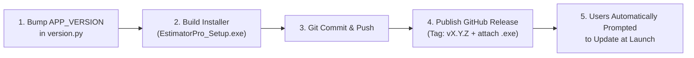

# Estimator Pro — Developer Release & Update Guide

This guide details the complete end-to-end workflow for preparing, building, and publishing updates for **Estimator Pro**. Following these steps ensures that all active installations automatically detect, download, and install the new version.

---

## Quick Summary of the Update Flow



---

## Step-by-Step Release Instructions

### Step 1: Bump the Version Number

Edit [`version.py`](file:///c:/Users/Consar-Kilpatrick/Estimator_Pro_20May26/estimator/version.py) in the project root:

```python
# version.py
# Single source of truth for the application version.
# Bump this value before each release.

APP_VERSION = "1.0.1"  # Increment following Semantic Versioning (MAJOR.MINOR.PATCH)
```

> [!IMPORTANT]
> Always use standard semantic versioning:
> - **PATCH** (`1.0.1`): Bug fixes, minor visual adjustments.
> - **MINOR** (`1.1.0`): New features, backward-compatible enhancements.
> - **MAJOR** (`2.0.0`): Major redesigns, breaking database changes.

---

### Step 2: Run Unit Tests & Verification

Ensure all automated tests pass before packaging:

```powershell
python -m pytest PyTest/test_updater.py
```

---

### Step 3: Compile the Windows Installer

1. Build the standalone executable using PyInstaller (or your build script).
2. Package the output with **Inno Setup** into an installer:
   - Output filename: `EstimatorPro_Setup.exe` (or `EstimatorPro_Setup_v1.0.1.exe`)
   - Ensure the installer replaces existing binary files in the user's installation directory.

> [!TIP]
> **Do NOT include any `.db` files in the installer package (`construction_costs.db` / `construction_rates.db`).**
> Estimator Pro automatically initializes fresh SQLite databases on first run with clean trial dates, default settings, and sample data. Omitting database files from the installer guarantees updates will never overwrite or corrupt existing user data.

---

### Step 4: Commit and Push Code to GitHub

```powershell
git add .
git commit -m "Release v1.0.1: [Brief summary of changes]"
git push origin main
```

---

### Step 5: Create and Publish the GitHub Release

1. Navigate to the GitHub repository: **[github.com/kilpatrickap/estimator](https://github.com/kilpatrickap/estimator)**
2. In the right-hand sidebar, click **Releases** → **"Draft a new release"** (or click **Releases/tags**).
3. Fill in the release fields:
   - **Choose a tag**: Type `v1.0.1` (make sure it starts with `v` and matches `APP_VERSION`). Click *+ Create new tag*.
   - **Target**: `main`
   - **Release title**: `Estimator Pro v1.0.1`
   - **Description**: Add bullet points describing the improvements, new features, or bug fixes:
     ```markdown
     ### What's New in v1.0.1
     - 🚀 Added automated rate buildup generator
     - 🛠️ Fixed Excel PBOQ export column formatting
     - ⚡ Improved startup performance
     ```
4. **Attach binaries**:
   - Drag and drop your compiled **`EstimatorPro_Setup.exe`** into the *Attach binaries by dropping them here or selecting them* box.
5. Click **"Publish release"**.

---

## What Happens on the User's Computer?

Once the release is published, no server maintenance or manual emails are required:

### 1. Automatic Startup Detection (Passive)
- When the user opens Estimator Pro, [`trial_splash.py`](file:///c:/Users/Consar-Kilpatrick/Estimator_Pro_20May26/estimator/trial_splash.py) queries the GitHub Releases API quietly in a background thread.
- If `v1.0.1` is newer than their installed version:
  - A blue notification banner appears on their splash screen:
    > **🔄 v1.0.1 is available (52.4 MB) &nbsp;&nbsp; `[Download]` &nbsp; `[Skip]`**
  - Clicking **Download** immediately fetches the installer and launches it.
  - Clicking **Skip** saves their preference to their local database (`skipped_update_version = "v1.0.1"`) so they are not asked again until `v1.0.2`.

### 2. In-App Check (Active)
- The user can click **Help → Check for Updates...** at any time.
- Estimator Pro opens the **UpdateDialog** modal with:
  - The new version number & download size.
  - The formatted **What's New** release notes you wrote on GitHub.
  - **`[Download Update]`**, **`[Remind Me Later]`**, and **`[Skip This Version]`** buttons.

### 3. Installation
- When the user clicks **Download Update**, the app downloads the `.exe` asset to a temp folder with a live progress bar.
- Once downloaded, it prompts: *"The update has been downloaded. Would you like to launch the installer now?"*
- Estimator Pro launches the Inno Setup installer and exits cleanly so files can be updated without Windows file-locking conflicts.

---

## Best Practices & Tips for Developers

1. **Naming Assets**: The updater searches the release assets for any `.exe` or `.msi` file. Naming your installer `EstimatorPro_Setup.exe` or `EstimatorPro_Setup_v1.0.1.exe` works automatically.
2. **Release Notes Formatting**: The `body` of the GitHub release is rendered directly inside the in-app update dialog. Use clean markdown bullet points for readability.
3. **No Releases Published (404 Handling)**: If no releases exist yet on GitHub, the app gracefully reports *"You are running the latest version"*.
