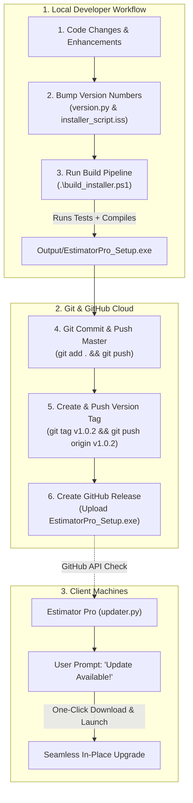

# Estimator Pro — Git & App Update Release Tutorial

This tutorial provides a complete step-by-step developer guide on how to update **Estimator Pro**, commit changes cleanly with Git, tag versions, and publish official releases on GitHub so that active users receive automated update notifications via the built-in auto-updater.

---

## 1. How the End-to-End Update Ecosystem Works



---

## 2. Step-by-Step App Update & Release Checklist

Follow these **6 steps** whenever you are ready to publish a new version (for example, upgrading from `v1.0.1` to `v1.0.2`):

### Step 1: Bump Application Version Numbers
Open the following two files and increment the version string:

1. **[`version.py`](file:///c:/Users/Consar-Kilpatrick/Estimator_Pro_20May26/estimator/version.py)**:
   ```python
   # version.py
   APP_VERSION = "1.0.2"
   ```

2. **[`installer_script.iss`](file:///c:/Users/Consar-Kilpatrick/Estimator_Pro_20May26/estimator/installer_script.iss)**:
   ```ini
   #define MyAppVersion "1.0.2"
   ```

---

### Step 2: Build the Installer (`.\build_installer.ps1`)
In your PowerShell terminal, execute:

```powershell
.\build_installer.ps1
```

This automated script will:
1. Clean old `build/`, `dist/`, and `Output/` folders.
2. Run the **PyTest automated test suite** (77+ tests) to guarantee calculation integrity.
3. Compile the standalone Python binary with PyInstaller.
4. Compile the Windows Setup Wizard via Inno Setup into:
   ```text
   estimator\Output\EstimatorPro_Setup.exe
   ```

---

### Step 3: Commit and Push Source Code Changes
Stage your clean source code and push to GitHub:

```powershell
# 1. Check changed files
git status

# 2. Stage all modifications (respecting .gitignore)
git add .

# 3. Commit with a descriptive message
git commit -m "Release v1.0.2: Feature improvements and bug fixes"

# 4. Push code to GitHub
git push origin master
```

---

### Step 4: Create and Push the Release Tag
Git tags mark exact version checkpoints that GitHub Releases and [`updater.py`](file:///c:/Users/Consar-Kilpatrick/Estimator_Pro_20May26/estimator/updater.py) use for version comparison.

```powershell
# Create local version tag
git tag v1.0.2

# Push the tag to GitHub
git push origin v1.0.2
```

> [!NOTE]
> Always prefix version tags with `v` (e.g. `v1.0.2`), which matches the regex in [`updater.py`](file:///c:/Users/Consar-Kilpatrick/Estimator_Pro_20May26/estimator/updater.py).

---

### Step 5: Publish the GitHub Release
1. Open your browser and navigate to:
   👉 [https://github.com/kilpatrickap/estimator/releases/new](https://github.com/kilpatrickap/estimator/releases/new)
2. **Choose a tag**: Select `v1.0.2`.
3. **Release title**: Enter `Estimator Pro v1.0.2`.
4. **Description**: List the changelog highlights:
   ```markdown
   ## What's New in v1.0.2
   - Enhanced Rate Buildup calculations.
   - Updated analytics dashboards.
   - Performance and export stability improvements.
   ```
5. **Attach binary asset**:
   - Drag and drop `Output\EstimatorPro_Setup.exe` into the **Attach binaries** area.
   - Wait for the upload bar to reach 100%.
6. Click **Publish release**.

---

### Step 6: Verify In-App Auto-Update
Once published on GitHub:
- When any client opens Estimator Pro or clicks **Help > Check for Updates...**, [`updater.py`](file:///c:/Users/Consar-Kilpatrick/Estimator_Pro_20May26/estimator/updater.py) queries the GitHub Releases API.
- The app displays the changelog dialogue and offers a one-click button to download and launch the new installer.

---

## 3. Git Command Quick Reference

| Command | Purpose |
| :--- | :--- |
| `git status` | Displays all modified, added, or untracked files. |
| `git diff` | Shows exact line-by-line changes made since the last commit. |
| `git add .` | Stages all modified source files for the next commit (respects `.gitignore`). |
| `git commit -m "Message"` | Records a permanent snapshot in local Git history. |
| `git push origin master` | Uploads local commits to the remote GitHub repository. |
| `git tag -l` | Lists all existing version tags in the repository. |
| `git tag vX.X.X` | Creates a new version tag on the current commit. |
| `git push origin vX.X.X` | Pushes the specific tag to GitHub. |
| `git log --oneline -n 10` | Shows the last 10 commit titles in a compact view. |

---

## 4. Protected Files & `.gitignore` Architecture

Estimator Pro has a configured [`.gitignore`](file:///c:/Users/Consar-Kilpatrick/Estimator_Pro_20May26/estimator/.gitignore) that prevents unwanted files from entering Git history:

- **Build Artifacts** (`build/`, `dist/`, `Output/`, `Compiler/`): Excluded because compiled binaries belong in GitHub Releases, not source control.
- **Python Cache** (`__pycache__/`, `*.pyc`, `.pytest_cache/`): Excluded to prevent clutter.
- **Logs** (`logs/`, `*.log`): Excluded so developer runtime logs stay local.
- **Private Developer Tools** (`Dev/`): Excluded to keep internal license key generators and private scripts private.

---

## 5. Troubleshooting & FAQs

### Q1: What if `pytest` fails during Step 2 of `build_installer.ps1`?
**Answer**: Do not force packaging. Run `python -m pytest PyTest/` directly to see which test failed. Fix the underlying calculation or test assertion before recompiling to ensure your release is 100% stable.

### Q2: I accidentally created the wrong tag name. How do I delete and recreate it?
**Answer**:
```powershell
# Delete local tag
git tag -d v1.0.2

# Delete remote tag on GitHub
git push origin --delete v1.0.2

# Create correct tag and push
git tag v1.0.2
git push origin v1.0.2
```

### Q3: Can I re-upload a fixed installer to an existing GitHub release?
**Answer**: Yes! Go to GitHub Releases, click **Edit** on the release, delete the old `.exe` asset, drag in the newly built `Output\EstimatorPro_Setup.exe`, and click **Update release**.
