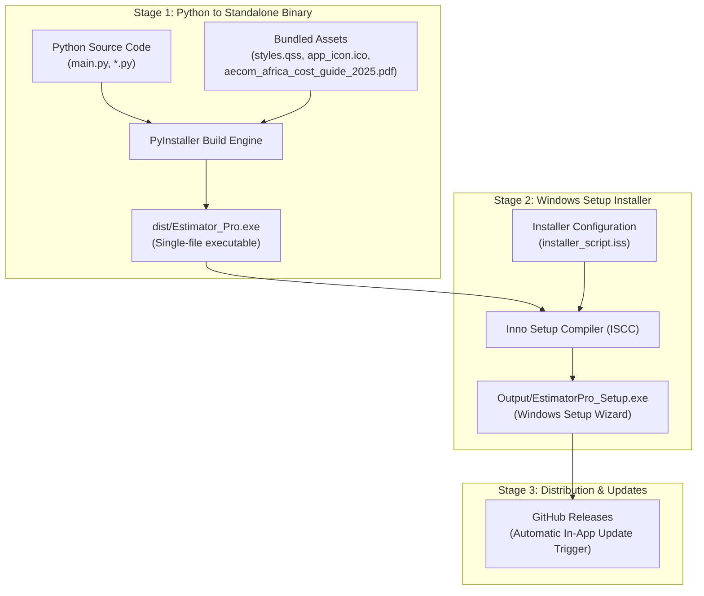

# Estimator Pro — Developer Installation & Packaging Tutorial

This tutorial provides a complete step-by-step guide for developers on how to package **Estimator Pro** into a standalone Windows executable and create a professional Windows setup installer (`EstimatorPro_Setup.exe`).

Following this standard build pipeline guarantees consistent, crash-free installations for end users and full compatibility with the application's built-in remote auto-updater.

---

## 1. Overview of the Build Pipeline

The packaging workflow consists of two main stages:



---

## 2. Prerequisites & Environment Setup

Before starting, ensure the required developer tools are installed on your Windows machine:

### A. Python Environment & Dependencies
Verify Python 3.10+ is installed and active:
```powershell
python --version
```

Install all application requirements and PyInstaller:
```powershell
python -m pip install --upgrade pip
python -m pip install "pyinstaller==6.22.0"
python -m pip install PyQt6 SQLAlchemy pandas openpyxl reportlab pillow
```

### B. Inno Setup 6 (Installer Generator)
Inno Setup is the free Windows installer compiler used to generate `EstimatorPro_Setup.exe`.

- **Download**: [https://jrsoftware.org/isdl.php](https://jrsoftware.org/isdl.php) (Download and run `innosetup-6.x.x.exe`)
- **Or via Windows Package Manager (winget)**:
  ```powershell
  winget install JRSoftware.InnoSetup
  ```
- Make sure the Inno Setup compiler (`iscc.exe`) is accessible in your `PATH` (typically located at `C:\Program Files (x86)\Inno Setup 6\iscc.exe`).

---

## 3. Stage 1: Compiling the Executable with PyInstaller

### Required Assets Checklist
The standalone binary requires several runtime resources to be packed directly into the executable via `--add-data`:
1. `app_icon.ico` — Application window and taskbar icon.
2. `styles.qss` — Core design stylesheet for UI widgets.
3. `aecom_africa_cost_guide_2025.pdf` — Embedded construction cost benchmark guide.

> [!IMPORTANT]
> In Windows PyInstaller, `--add-data` uses a semicolon (`;`) to separate the source path from the internal destination directory:
> `--add-data "source_file;destination_dir"`

---

### Option A: Build Using the Spec File (Recommended)
The project includes a pre-configured [`Estimator_Pro.spec`](file:///c:/Users/Consar-Kilpatrick/Estimator_Pro_20May26/estimator/Estimator_Pro.spec) file. Run:

```powershell
python -m PyInstaller Estimator_Pro.spec --clean
```

---

### Option B: Build Using the Full Command Line
If you need to regenerate the spec file or compile with custom flags:

```powershell
python -m PyInstaller `
    --name "Estimator_Pro" `
    --onefile `
    --windowed `
    --icon="app_icon.ico" `
    --add-data "app_icon.ico;." `
    --add-data "styles.qss;." `
    --add-data "aecom_africa_cost_guide_2025.pdf;." `
    --clean `
    main.py
```

#### Parameter Breakdown:
- `--name "Estimator_Pro"`: Sets the executable filename to `Estimator_Pro.exe`.
- `--onefile`: Bundles Python, libraries, and resources into a single self-contained executable.
- `--windowed`: Suppresses the background command prompt console window.
- `--icon="app_icon.ico"`: Embeds the Windows application icon into the `.exe` binary.
- `--add-data "...;."`: Packages runtime files into the internal temp directory (`sys._MEIPASS`).
- `--clean`: Clears PyInstaller cache before building.

---

### Verifying the Executable
Before proceeding to Stage 2, test the compiled binary:
1. Run `.\dist\Estimator_Pro.exe`.
2. Verify that:
   - The splash screen opens with the custom app icon.
   - The main window loads with styling intact from `styles.qss`.
   - The AECOM Cost Guide PDF opens from the Cost Modelling tab.
3. Close the application.

---

## 4. Stage 2: Packaging the Windows Installer with Inno Setup

To allow easy distribution, Start Menu shortcuts, and seamless silent background updates, we wrap `Estimator_Pro.exe` inside an Inno Setup installer.

### A. The Inno Setup Script (`installer_script.iss`)
Create or verify the [`installer_script.iss`](file:///c:/Users/Consar-Kilpatrick/Estimator_Pro_20May26/estimator/installer_script.iss) file in the project root:

```ini
; Inno Setup Script for Estimator Pro
; Compiler: Inno Setup 6+ (ISCC)

#define MyAppName "Estimator Pro"
#define MyAppVersion "1.0.1"
#define MyAppPublisher "KilTech Ent"
#define MyAppURL "https://github.com/kilpatrickap/estimator"
#define MyAppExeName "Estimator_Pro.exe"

[Setup]
; Unique AppId (do NOT change this across versions so upgrades replace cleanly)
AppId={{D819C3A1-94E5-4B83-B75B-B7C934E84F01}
AppName={#MyAppName}
AppVersion={#MyAppVersion}
AppPublisher={#MyAppPublisher}
AppPublisherURL={#MyAppURL}
AppSupportURL={#MyAppURL}
AppUpdatesURL={#MyAppURL}
DefaultDirName={autopf}\{#MyAppName}
DisableProgramGroupPage=yes
; Output configuration
OutputDir=Output
OutputBaseFilename=EstimatorPro_Setup
SetupIconFile=win_setup_icon.ico
Compression=lzma2/ultra64
SolidCompression=yes
WizardStyle=modern
ArchitecturesInstallIn64BitMode=x64compatible
; Permissions and update handling
PrivilegesRequired=lowest
CloseApplications=yes
RestartApplications=no

[Languages]
Name: "english"; MessagesFile: "compiler:Default.isl"

[Tasks]
Name: "desktopicon"; Description: "{cm:CreateDesktopIcon}"; GroupDescription: "{cm:AdditionalIcons}"; Flags: unchecked

[Files]
; Standalone compiled executable
Source: "dist\{#MyAppExeName}"; DestDir: "{app}"; Flags: ignoreversion
; Application & Setup icons
Source: "app_icon.ico"; DestDir: "{app}"; Flags: ignoreversion
Source: "win_setup_icon.ico"; DestDir: "{app}"; Flags: ignoreversion
; NOTE: DO NOT include .db files! Databases are auto-generated at runtime on first launch.

[Icons]
Name: "{autoprograms}\{#MyAppName}"; Filename: "{app}\{#MyAppExeName}"; IconFilename: "{app}\app_icon.ico"
Name: "{autodesktop}\{#MyAppName}"; Filename: "{app}\{#MyAppExeName}"; IconFilename: "{app}\app_icon.ico"; Tasks: desktopicon

[Run]
Description: "{cm:LaunchProgram,{#StringChange(MyAppName, '&', '&&')}}"; Filename: "{app}\{#MyAppExeName}"; Flags: nowait postinstall skipifsilent
```

> [!CAUTION]
> **CRITICAL: NEVER bundle `.db` files (`construction_costs.db` or `construction_rates.db`) in the installer.**
> Estimator Pro automatically provisions fresh SQLite databases on first run if they do not exist. Omitting database files from the installer prevents updates from accidentally overwriting or erasing user project data and custom rates.

---

### B. Compiling the Installer

#### Method 1: Using the Inno Setup GUI
1. Open **Inno Setup Compiler** from your Start menu.
2. Click **File → Open** and select `installer_script.iss`.
3. Click **Build → Compile** (or press `F9`).
4. The completed installer will be created in the `Output\` directory: `Output\EstimatorPro_Setup.exe`.

#### Method 2: Using the Command Line
You can compile silently directly from PowerShell:

```powershell
& "C:\Program Files (x86)\Inno Setup 6\iscc.exe" installer_script.iss
```

---

## 5. Automated Build Script (`build_installer.ps1`)

To automate the entire two-stage build in one command, run the following PowerShell script from the repository root:

```powershell
# build_installer.ps1
# Complete one-click packaging script for Estimator Pro

Write-Host "=============================================" -ForegroundColor Cyan
Write-Host " Estimator Pro - Build & Packaging Pipeline " -ForegroundColor Cyan
Write-Host "=============================================" -ForegroundColor Cyan

# 1. Clean previous build artifacts
Write-Host "`n[1/4] Cleaning previous build folders..." -ForegroundColor Yellow
if (Test-Path "build") { Remove-Item -Recurse -Force "build" }
if (Test-Path "dist") { Remove-Item -Recurse -Force "dist" }
if (Test-Path "Output") { Remove-Item -Recurse -Force "Output" }

# 2. Run unit tests
Write-Host "`n[2/4] Running automated tests..." -ForegroundColor Yellow
python -m pytest PyTest/
if ($LASTEXITCODE -ne 0) {
    Write-Host "❌ Unit tests failed! Aborting build." -ForegroundColor Red
    exit 1
}

# 3. Compile Python executable with PyInstaller
Write-Host "`n[3/4] Building standalone executable with PyInstaller..." -ForegroundColor Yellow
python -m PyInstaller Estimator_Pro.spec --clean
if ($LASTEXITCODE -ne 0) {
    Write-Host "❌ PyInstaller compilation failed!" -ForegroundColor Red
    exit 1
}

# 4. Compile Inno Setup installer
Write-Host "`n[4/4] Compiling Windows setup installer with Inno Setup..." -ForegroundColor Yellow
$isccPath = "C:\Program Files (x86)\Inno Setup 6\iscc.exe"
if (-not (Test-Path $isccPath)) {
    # Check alternate 64-bit location
    $isccPath = "C:\Program Files\Inno Setup 6\iscc.exe"
}

if (Test-Path $isccPath) {
    & $isccPath installer_script.iss
    if ($LASTEXITCODE -eq 0) {
        Write-Host "`n=============================================" -ForegroundColor Green
        Write-Host " ✅ BUILD SUCCESSFUL!" -ForegroundColor Green
        Write-Host " Installer ready at: Output\EstimatorPro_Setup.exe" -ForegroundColor Green
        Write-Host "=============================================" -ForegroundColor Green
    } else {
        Write-Host "❌ Inno Setup compilation failed!" -ForegroundColor Red
    }
} else {
    Write-Host "⚠️ Inno Setup (iscc.exe) not found. Compiled .exe is available in dist\Estimator_Pro.exe." -ForegroundColor DarkYellow
    Write-Host "Install Inno Setup 6 to generate Output\EstimatorPro_Setup.exe." -ForegroundColor DarkYellow
}
```

---

## 6. Testing & Validating the Installer

1. **Install Test**:
   - Double-click `Output\EstimatorPro_Setup.exe`.
   - Complete the installation wizard.
   - Verify that the desktop and Start Menu shortcuts are created with the proper icon.
   - Launch the app from the shortcut and test general workflows.
2. **Upgrade Test**:
   - Bump the version in `version.py` and `installer_script.iss` (e.g., from `1.0.1` to `1.0.2`).
   - Run the new installer over the existing installation.
   - Verify that user settings, existing projects, and local databases remain intact.
3. **Uninstall Test**:
   - Go to Windows **Settings → Apps → Installed apps**.
   - Select **Estimator Pro** and click **Uninstall**.
   - Verify the program files are removed cleanly.

---

## 7. Publishing Updates to GitHub Releases

Once `EstimatorPro_Setup.exe` is built and verified:
1. Update `APP_VERSION` in [`version.py`](file:///c:/Users/Consar-Kilpatrick/Estimator_Pro_20May26/estimator/version.py).
2. Commit and push changes to `main`.
3. Create a GitHub Release with tag `vX.Y.Z` (e.g., `v1.0.1`) at [github.com/kilpatrickap/estimator](https://github.com/kilpatrickap/estimator).
4. Attach `Output\EstimatorPro_Setup.exe` as the release binary.
5. All active user installations will automatically detect the new version upon launch and offer a one-click in-app update.

For detailed release workflow instructions, refer to [`Dev/release_guide.md`](file:///c:/Users/Consar-Kilpatrick/Estimator_Pro_20May26/estimator/Dev/release_guide.md).

---

## 8. Common Troubleshooting & Gotchas

| Issue | Cause | Solution |
| :--- | :--- | :--- |
| `'pyinstaller' is not recognized` | Python Scripts directory is not in Windows `PATH`. | Run via Python module syntax: `python -m PyInstaller ...` |
| `FileNotFoundError: styles.qss` | Resources were not bundled or unpacked path was not checked. | Use `getattr(sys, '_MEIPASS', ...)` in code and pass `--add-data "styles.qss;."`. |
| PDF Viewer fails to open guide | Embedded PDF file missing from PyInstaller spec. | Ensure `('aecom_africa_cost_guide_2025.pdf', '.')` is in `datas` list. |
| User data reset after update | Installer overwrote user `.db` files. | **Never** include `construction_costs.db` or `construction_rates.db` in `installer_script.iss`. |
| Windows SmartScreen warning | Unsigned executable/installer. | Code sign binaries with a digital certificate or click *More info → Run anyway* during internal testing. |
