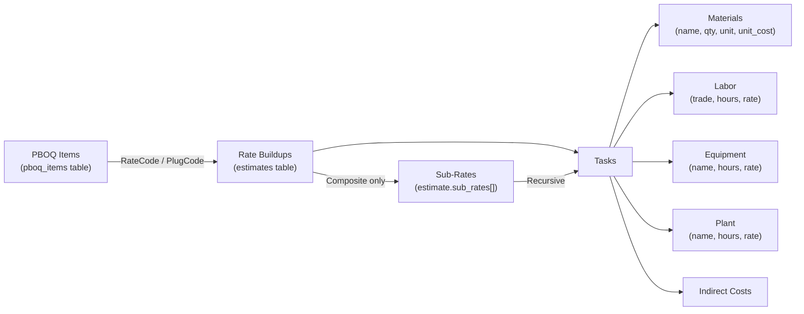
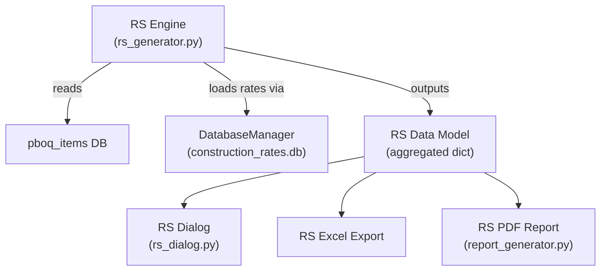

# Resources Schedule (RS)

## What It Is

A **Resources Schedule (RS)** is a consolidated, project-wide register that lists every resource required across all BOQ items, with **aggregated quantities** and **total costs**. It answers: *"How much of each material, labour, equipment, and plant does this project need, and what will it cost in total?"*

---

## Data Flow

Here's how the data currently lives in the system:



Each PBOQ row has:
- A **BOQ quantity** (from the physical `Qty` column in `pboq_items`)
- A **linked rate code** (`RateCode`, `PlugCode`, or `SubbeeCode`) that maps to a rate buildup in `construction_rates.db`

Each rate buildup (`Estimate` object) contains:
- **Tasks** → each with **Materials**, **Labor**, **Equipment**, **Plant**, **Indirect Costs**
- Resource quantities are **per 1 unit** of the BOQ item

---

## Formula → Quantity Flow

Resource quantities are entered via a formula input (e.g., `= 1m3 x 1.20 factor x 1.10 transport x 1.2 co`).

The formula parser (`EditItemDialog.parse_single_line()`) does the following:
1. Strips unit text (regex removes `m3`, `hrs`, `factor`, etc.)
2. Strips quoted comments (anything in `"double quotes"`)
3. Normalises operators (`x` → `*`, `%` → `/100`)
4. Evaluates the remaining math expression
5. Sums all `=` lines → stores result as `qty` (materials) or `hours` (labor/equipment/plant)

**The formula text is preserved in `item_data['formula']`, but the evaluated numeric result is what's stored in `qty`/`hours`.** The RS generator does **not** need to re-parse formulas — the quantities are already computed and saved.

### Example — Rate ETWK1F (Simple Rate, per 1 m³)

| Ref | Resource | Formula Input | Evaluated Qty | Unit Rate | Cost |
|-----|----------|---------------|---------------|-----------|------|
| 1.1 | Material: Laterite | `= 1m3 x 1.20 x 1.10 x 1.2` | **1.58** m³ | $13.76 | $21.80 |
| 1.2 | Labor: Labourer | `= 1m3 x 0.167hrs/m3 x 8hrs` | **1.34** hr | $1.86 | $2.48 |
| 1.3 | Plant: Roller Compactor | `= 1m3 / 8 hrs x 0.025` | **0.00** day | $183.49 | $0.57 |

If the BOQ quantity for this item is **500 m³**, the RS yields:
- Laterite: 1.58 × 500 = **790 m³**
- Labourer: 1.34 × 500 = **670 hrs**
- Roller Compactor: 0.00 × 500 = **1.56 days**

---

## Handling Rate Types

### Simple / Plug Rates

Resources are directly in the rate's Tasks. The scaling chain is:

```
RS Qty = resource_qty (per unit) × BOQ_qty
```

Task-level `quantity` is decorative (not used as a multiplier in `calculate_totals()`).

### Composite Rates

Composite rates contain **sub-rates** (references to other rate buildups). When a sub-rate is imported, the system creates a "fake" material entry in an **"Imported Rates" task**:

```python
imported_task.add_material(
    name="CONC1B: Reinforced in-situ concrete...",
    quantity=0.04,          # conversion quantity
    unit="m3",              # converted unit
    unit_cost=calc_subtotal # sub-rate's net rate
)
```

The actual resources (cement, rebar, etc.) live inside each sub-rate's own estimate object (`estimate.sub_rates[]`).

### Example — Rate MISC1B (Composite Rate, per 1 m of lintel)

```
MISC1B (per 1 m of lintel)
├── Sub-rate: CONC1B (qty = 0.04 m³)
│   └── Task: "Concrete work"
│       ├── Material: Cement × 6 bags     → RS qty = 6 × 0.04 = 0.24 bags/m
│       ├── Material: Aggregate × 0.8 m³  → RS qty = 0.8 × 0.04 = 0.032 m³/m
│       └── Labor: Labourer × 2 hrs       → RS qty = 2 × 0.04 = 0.08 hrs/m
├── Sub-rate: FMWK1A (qty = 0.75 m²)
│   └── Material: Plywood × 1.2 sheets    → RS qty = 1.2 × 0.75 = 0.90 sheets/m
└── Sub-rate: RFMT1A (qty = 0.01 ton)
    └── Material: Rebar 10mm × 1.0 ton    → RS qty = 1.0 × 0.01 = 0.01 ton/m
```

If the BOQ quantity is **50 m**, the RS yields:
- Cement: 0.24 × 50 = **12 bags**
- Aggregate: 0.032 × 50 = **1.6 m³**
- Plywood: 0.90 × 50 = **45 sheets**
- Rebar 10mm: 0.01 × 50 = **0.5 ton**
- Labourer: 0.08 × 50 = **4 hrs**

The full scaling chain for composite rates:

```
RS Qty = resource_qty × sub_rate_qty × BOQ_qty
```

Sub-rates can themselves be composite (nested), requiring **recursive traversal**.

---

## Core Algorithm

```
For each priced PBOQ row:
    1. Get BOQ quantity from the physical Qty column
    2. Get the linked rate code (RateCode / PlugCode)
    3. Load the rate buildup from construction_rates.db
    4. If Simple/Plug Rate:
        - Walk Tasks → Resources
        - For each resource: RS_qty = resource_qty × BOQ_qty
    5. If Composite Rate:
        - Skip the "Imported Rates" task (fake materials)
        - Walk estimate.sub_rates[]
        - For each sub-rate:
            - sub_multiplier = sub_rate.quantity
            - Recursively walk the sub-rate's Tasks → Resources
            - For each resource: RS_qty = resource_qty × sub_multiplier × BOQ_qty
            - If the sub-rate is itself composite, recurse deeper
    6. Aggregate by resource name + unit across the entire project
    7. Apply currency conversion for multi-currency resources
```

---

## Unlinked / Unpriced Rows

| BOQ Pricing Type | Has Resource Breakdown? | RS Action |
|-----------------|------------------------|-----------|
| Rate Buildup (PlugCode/RateCode) | ✅ Yes | Extract & aggregate |
| Gross Rate (manual, no code) | ❌ No | Skip or flag as "unbroken-down" |
| Subcontractor Rate | ❌ No | Skip or list as lump sum |
| Provisional Sum | ❌ No | Skip |
| PC Sum | ❌ No | Skip |
| Daywork | ❌ (or partial) | Skip or extract if linked |

---

## Proposed RS Output Structure

### Grouped by Resource Type

**Materials**

| # | Material Name | Unit | Total Qty | Unit Rate | Currency | Total Cost | Used In (Rate Codes) |
|---|---------------|------|-----------|-----------|----------|------------|----------------------|
| 1 | Cement (42.5N) | bag | 12,450 | 85.00 | GHS (₵) | 1,058,250 | CONC001, CONC003, WALL002 |
| 2 | 12mm Rebar | ton | 38.5 | 7,200.00 | GHS (₵) | 277,200 | RFMT001, RFMT002 |

**Labor**

| # | Trade | Unit | Total Hours | Rate | Currency | Total Cost | Used In |
|---|-------|------|-------------|------|----------|------------|---------|
| 1 | Labourer | hr | 14,200 | 1.86 | USD ($) | 26,412 | ETWK1F, CONC1B |

**Equipment & Plant** — same structure.

---

## Design Decisions

### Aggregation Key
Aggregate by **normalised name + unit**. Normalise by stripping whitespace, lowercasing, and removing punctuation. Use `material_id` as a tiebreaker when available.

### Scope Options
- **All sheets** — full project RS
- **Current sheet only** — RS for a single bill/trade
- **Selected rows** — RS for a custom selection
- **By package** — RS per subcontractor package

### Waste / Contingency Factor
Optional configurable waste % per material (e.g., +5% on cement, +10% on tiles).

### Output Formats
- **In-app dialog/table** — quick review, interactive filtering
- **Excel export** — procurement, sharing with QS team
- **PDF report** — formal submission

---

## Implementation Architecture



| File | Purpose |
|------|---------|
| `rs_generator.py` | Core engine: walks PBOQ → loads rates → recurses composites → aggregates resources |
| `rs_dialog.py` | Interactive viewer with filtering, sorting, grouping by resource type |
| Extend `pboq_export.py` | Add Excel export capability for RS |
| Extend `report_generator.py` | Add PDF report for RS |
