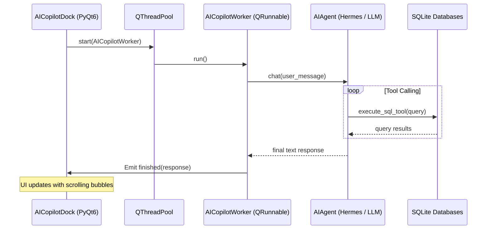

# AI Estimating Copilot Integration Plan

This plan details the design and step-by-step implementation for adding an **AI Estimating Copilot** into **Estimator Pro**. The Copilot will live as a beautiful, modern PyQt6 Dock Widget that interacts asynchronously with the local SQLite databases (`construction_costs.db` / `construction_rates.db`) and the active project bill of quantities (BOQ) and all folders and files in the project root directory.

---

## Proposed Architecture

---

## Proposed Changes

### Core Integration

#### [NEW] [ai_tools.py](file:///c:/Users/Consar-Kilpatrick/Estimator_Pro_20May26/estimator/ai_tools.py)
This module will define custom Python functions (tools) that the AI agent can call to perform database lookups and operations on the active project.
*   `query_active_estimate_summary()`: Retrieves KPIs (Total Bid Value, Net Cost, Gross Margin %).
*   `query_historical_rates(query_str)`: Searches historical rate databases.
*   `get_outlier_items()`: Scans the active BOQ for pricing anomalies (deviations of ±15%).
*   `recommend_composite_buildup(item_description)`: Queries historical rates and drafts suggested composite rate breakdowns (materials, labor, plant).

#### [NEW] [ai_worker.py](file:///c:/Users/Consar-Kilpatrick/Estimator_Pro_20May26/estimator/ai_worker.py)
A thread-safe PyQt background worker using `QRunnable` and `QSignals`. This prevents the GUI from freezing during API requests or database analysis.
*   Uses `pyqtSignal` to communicate with the main thread.
*   Implements `AICopilotWorker` wrapping the agent execution.

#### [NEW] [ai_copilot_dock.py](file:///c:/Users/Consar-Kilpatrick/Estimator_Pro_20May26/estimator/ai_copilot_dock.py)
A custom `QDockWidget` implementing a stunning chat UI:
*   **Vibrant, harmonious dark/light styling** matching the green/blue tones of Estimator Pro.
*   **Smooth micro-animations** and a sleek typing loader icon during active operations.
*   **Message Bubbles:** Alternating modern rounded panels for user queries (blue/grey) and AI responses (soft green) with subtle drop shadows.
*   **Context Awareness:** Tracks which project/dialog is currently active in the workspace to automatically load relevant context.

---

### UI/UX & Main Window Wiring

#### [MODIFY] [main_window.py](file:///c:/Users/Consar-Kilpatrick/Estimator_Pro_20May26/estimator/main_window.py)
We will register and dock the new widget inside `MainWindow`:
*   Add `AICopilotDock` as a dockable widget positioned on the right-hand side.
*   Add an "AI Copilot" action to the horizontal navbar and View/Window menus to let the user easily toggle the dock panel.
*   Ensure thread pool (`QThreadPool.globalInstance()`) is initialized and ready to run background tasks.

---

## Verification Plan

### Automated Tests
*   Create `PyTest/test_ai_tools.py` to unit-test all database-querying tools and verify they return accurate data models from SQLite.
*   Create mock tests for `ai_worker.py` to verify signals emit correctly under normal operation and errors.

### Manual Verification
*   Launch Estimator Pro and verify the layout adaptiveness with the newly added AI Dock panel.
*   Verify the scroll container behavior under lengthy outputs.
*   Force an artificial delay/timeout on the LLM API to confirm the desktop UI remains highly responsive during queries.
