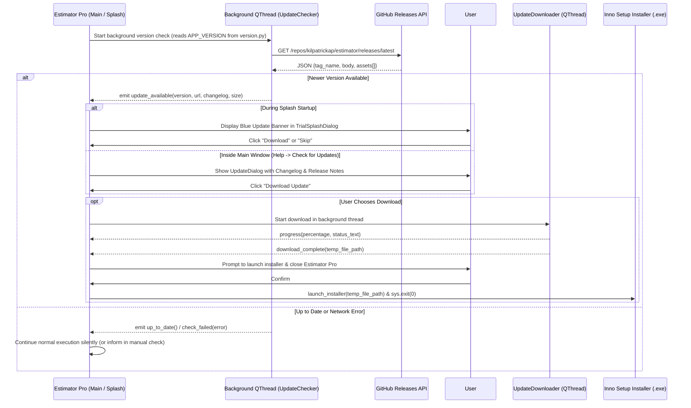

# Implementation Plan: Remote Auto-Update System for Estimator Pro

Estimator Pro is a PyQt6 desktop application distributed on Windows. This implementation plan details the architecture, design, and integration of the **Remote Auto-Update System** that queries remote releases (via GitHub Releases API or custom manifest), alerts the user when a newer version is available, and provides seamless downloading and execution of the Inno Setup installer without blocking the UI.

---

## Architecture & Workflow



---

## Design Principles & User Experience

1. **Zero UI Blocking**: All network operations (metadata checks, file downloads) run on dedicated background `QThread` instances.
2. **Graceful Offline Tolerance**: If the user is offline or GitHub API is unreachable, the application continues startup with zero delay or modal error popups.
3. **Dual Entry Points**:
   - **Passive Startup Discovery**: Checks quietly on startup during the trial splash screen and displays a non-intrusive banner.
   - **Active Manual Check**: Accessible anytime via **Help → Check for Updates...** in the main menu bar.
4. **Skip Version Memory**: Users can click "Skip This Version" which persists `skipped_update_version` in the database settings table so they are not prompted again until a newer version is released. Manual checks always bypass the skip filter.
5. **Safe Installer Execution**: Downloads the Inno Setup executable to a secure temporary directory, prompts the user to save work, launches the installer, and cleanly shuts down the app to avoid Windows file-lock conflicts.

---

## Component Breakdown

### 1. Version Constant
#### [`version.py`](file:///c:/Users/Consar-Kilpatrick/Estimator_Pro_20May26/estimator/version.py)
Single source of truth for the application version using semantic versioning (`MAJOR.MINOR.PATCH`).
```python
# version.py
APP_VERSION = "1.0.0"
```

---

### 2. Update Engine & UI Dialogs
#### [`updater.py`](file:///c:/Users/Consar-Kilpatrick/Estimator_Pro_20May26/estimator/updater.py)

Contains the core logic and UI components:
* **`UpdateChecker (QThread)`**:
  - Fetches `https://api.github.com/repos/kilpatrickap/estimator/releases/latest`.
  - Compares remote tag against `APP_VERSION` using `_parse_version()` tuple comparison.
  - Extracts release notes (`body`) and identifies `.exe` / `.msi` assets from the release payload.
  - Signals: `update_available`, `up_to_date`, `check_failed`.
* **`UpdateDownloader (QThread)`**:
  - Downloads installer files in 64 KB chunks.
  - Computes and emits download percentage and transfer rates (MB downloaded vs total).
  - Saves file to a dedicated temp directory created with `tempfile.mkdtemp(prefix="estimator_update_")`.
  - Signals: `progress`, `download_complete`, `download_failed`.
* **`launch_installer(file_path)`**:
  - Executes the installer executable via `subprocess.Popen([file_path, "/SILENT"])`.
* **`UpdateDialog (QDialog)`**:
  - Dark-mode modal dialog displaying the new version tag, current version, styled changelog block, file size, and action buttons (`Download Update`, `Skip This Version`, `Remind Me Later`).
  - Integrated progress bar and status feedback during download.
* **`ManualUpdateCheckDialog (QDialog)`**:
  - Lightweight dialog with indeterminate progress bar for the **Help → Check for Updates...** menu action.

---

### 3. Trial Splash Screen Integration
#### [`trial_splash.py`](file:///c:/Users/Consar-Kilpatrick/Estimator_Pro_20May26/estimator/trial_splash.py)

* **Background Launch**: In `TrialSplashDialog.__init__()`, kicks off `_start_update_check()` in a background thread.
* **Update Banner UI**:
  - Positioned above the progress bar card.
  - Displays version badge, "A new version is available", "Download" button, and "Skip" button.
* **Handlers**:
  - `_on_splash_update_available()`: Populates banner text and adjusts dialog window size dynamically.
  - `_on_splash_download()`: Launches the browser or download handler.
  - `_on_splash_update_skip()`: Persists the skipped version in DB and hides the banner.

---

### 4. Main Window Integration
#### [`main_window.py`](file:///c:/Users/Consar-Kilpatrick/Estimator_Pro_20May26/estimator/main_window.py)

* **Window Title**: Displays current version dynamically:
  ```python
  self.setWindowTitle(f"Estimator Pro  v{APP_VERSION}")
  ```
* **Help Menu**:
  - Added **Help → Check for Updates...** menu item.
  - Added **Help → About Estimator Pro** modal.
* **Manual Check Handlers**:
  - `_check_for_updates()`: Triggers background `UpdateChecker` with status bar feedback.
  - `_start_update_download()`: Initiates download with live status updates in the status bar and prompts user before installer launch.

---

### 5. Application Entry Point
#### [`main.py`](file:///c:/Users/Consar-Kilpatrick/Estimator_Pro_20May26/estimator/main.py)

- Ensures database initialization before splash screen execution.
- Trial splash screen executes update check seamlessly during trial gating checks.

---

## Database Settings Schema

The updater utilizes the existing `settings` key-value table managed by `DatabaseManager`:

| Key | Type | Description |
|---|---|---|
| `skipped_update_version` | `TEXT` | Version tag (e.g. `v1.1.0`) that the user explicitly chose to skip. |

---

## Verification & Testing Plan

### Automated Tests
1. **Version Comparison Tests**:
   - `_parse_version("v1.0.0")` vs `_parse_version("1.0.1")`
   - `_is_newer("v1.1.0", "1.0.0") == True`
   - `_is_newer("v1.0.0", "1.0.0") == False`
   - `_is_newer("v0.9.5", "1.0.0") == False`
2. **Asset Detection Tests**:
   - `_find_installer_asset()` correctly filters `.exe` assets from release payloads.

### Manual Verification
1. **Startup Check in Splash**:
   - Launch application with internet enabled and observe background check.
   - Disconnect network and verify splash starts without delays or errors.
2. **Help Menu Check**:
   - Click **Help → Check for Updates...**
   - Confirm status messages ("You're up to date" vs "Update Available").
3. **Skip Functionality**:
   - Click "Skip This Version" and restart application to verify banner suppression.
