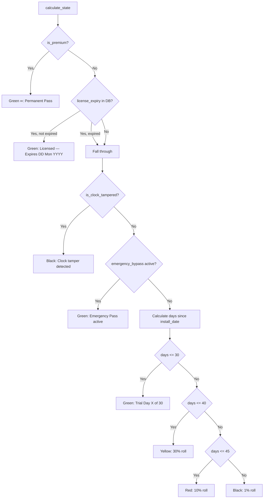

# Implementation Plan: HMAC-SHA256 Timed License Key System

This plan details the design and implementation of an **offline, cryptographically verifiable license key system** for **Estimator Pro**. Keys are timed (30/90/365-day), generated by the developer offline, and validated entirely on the client with no server required.

---

## Decisions

> [!IMPORTANT]
> **Decision 1 — Timed keys only.**
> All license keys encode an expiry date. There is no permanent key type.
> This creates a natural renewal revenue cycle.

> [!IMPORTANT]
> **Decision 2 — On expiry, degrade back to trial days.**
> When a timed license expires, `calculate_state()` falls through to the original
> trial day calculation based on `install_date`. The user re-enters Yellow / Red / Black
> depending on how long ago they installed the app. This avoids a sudden hard lock
> and gives the user a fair window to renew before gating intensifies.

---

## How It Works — Overview

```
Developer (offline)                    App (client)
─────────────────────────────────────────────────────────────
make_key(days=30)                      User enters key
  │                                      │
  ├─ expiry = today + 30 days            ├─ parse XXXX-XXXXXX-XXXXXXXX-XXXXXXXX
  ├─ serial = "A8B9CD" (random)          │  (EPRO-{SERIAL}-{YYYYMMDD}-{SIG8})
  ├─ message = "A8B9CD:20260724"         ├─ recompute HMAC-SHA256(secret, serial + ":" + expiry_str)[:8]
  ├─ sig = HMAC-SHA256(secret,           ├─ compare → match? → valid key
  │         message)[:8]                 ├─ today <= expiry? → not expired
  └─ "EPRO-A8B9CD-20260724-A3F7C9D1"     └─ write license_expiry to DB → Green Pass
```

---

## Key Format

```
EPRO-A8B9CD-20260724-A3F7C9D1
│    │      │        │
│    │      │        └─ 8-char uppercase HMAC-SHA256 signature (first 8 hex chars)
│    │      └───────── Expiry date: YYYYMMDD (baked into the key)
│    └──────────────── Unique random 6-character serial
└───────────────────── Product prefix — first validity check
```

**Examples:**

| Duration | Key Example |
|---|---|
| 30 days  | `EPRO-A8B9CD-20260724-A3F7C9D1` |
| 90 days  | `EPRO-X2Y3Z4-20260921-F2B7A3E0` |
| 365 days | `EPRO-K9L8M7-20270624-C9D14F2B` |

---

## Proposed Changes

---

### Developer Key Generator (Private Tool)

#### [NEW] `license_keygen.py` — NOT shipped with the app. Developer-only.

A standalone script kept privately by the developer to generate valid license keys.

```python
# license_keygen.py
# PRIVATE — Never include in the distributed app package.
import hmac, hashlib
from datetime import date, timedelta

SECRET = "EstimatorProKeySecret2026"  # Must match SECRET_KEY in trial_splash.py

def make_key(days: int = 30) -> str:
    """Generate a timed HMAC-SHA256 license key valid for `days` days from today, with a unique serial."""
    import random
    import string
    expiry = (date.today() + timedelta(days=days)).strftime("%Y%m%d")
    serial = "".join(random.choices(string.ascii_uppercase + string.digits, k=6))
    message = f"{serial}:{expiry}"
    sig = hmac.new(SECRET.encode(), message.encode(), hashlib.sha256).hexdigest()[:8].upper()
    return f"EPRO-{serial}-{expiry}-{sig}"

if __name__ == "__main__":
    print(f"30-day  key: {make_key(30)}")
    print(f"90-day  key: {make_key(90)}")
    print(f"365-day key: {make_key(365)}")
```

> [!CAUTION]
> The `SECRET` string in `license_keygen.py` must **always match** `SECRET_KEY` in
> `trial_splash.py`. If these ever diverge, all previously issued keys become invalid.
> Store `license_keygen.py` securely — anyone with this file can generate unlimited valid keys.

---

### Components

#### [MODIFY] [trial_splash.py](file:///c:/Users/Consar-Kilpatrick/Estimator_Pro_20May26/estimator/trial_splash.py)

---

##### 1. New constants and `validate_license_key()` helper

Add `SECRET_KEY` at module level (distinct from `SECRET_SALT` used for legacy permanent signatures).
Add `validate_license_key()` which returns one of 5 distinct states:

```python
SECRET_KEY = "EstimatorProKeySecret2026"

def validate_license_key(key: str):
    """
    Validates a timed HMAC-SHA256 license key with an embedded serial.
    Returns:
        (True,  expiry_date)   — valid and not yet expired
        (False, "format")      — key is malformed or wrong prefix
        (False, "signature")   — HMAC does not match (key is invalid/forged)
        (False, "expired")     — key is structurally valid but past expiry
    """
    try:
        parts = key.strip().upper().split("-")
        if len(parts) != 4 or parts[0] != "EPRO":
            return False, "format"
        serial, expiry_str, provided_sig = parts[1], parts[2], parts[3]
        if len(serial) != 6 or len(expiry_str) != 8 or len(provided_sig) != 8:
            return False, "format"
        expected_sig = hmac.new(
            SECRET_KEY.encode(), f"{serial}:{expiry_str}".encode(), hashlib.sha256
        ).hexdigest()[:8].upper()
        if provided_sig != expected_sig:
            return False, "signature"
        expiry_date = datetime.strptime(expiry_str, "%Y%m%d").date()
        if date.today() > expiry_date:
            return False, "expired"
        return True, expiry_date
    except Exception:
        return False, "format"
```

---

##### 2. Modified `calculate_state()` — new priority order

```
Priority:
  1. Permanent signature (is_premium)        → Green forever
  2. Timed license (license_expiry in DB)    → Green until expiry, then fall through
  3. Emergency bypass date                   → Green until bypass expires
  4. Clock tamper detected                   → Force Black
  5. Trial day calculation                   → Green / Yellow / Red / Black
```

New logic inserted after the `is_premium` check:

```python
# 2. Timed license check
license_expiry_str = self.db.get_setting("license_expiry")
if license_expiry_str:
    try:
        license_expiry = datetime.strptime(license_expiry_str, "%Y%m%d").date()
        days_left = (license_expiry - date.today()).days
        if days_left >= 0:
            return "Green", 1.0, (
                f"Licensed — Expires {license_expiry.strftime('%d %b %Y')}"
                f"  ({days_left} day{'s' if days_left != 1 else ''} left)"
            )
        # Expired — fall through to trial day calculation below
    except Exception:
        pass
```

When the license expires, execution falls through naturally to trial-day logic.
The user re-enters **Yellow / Red / Black** based on `install_date` age.
They are **not** artificially forced to Black.

---

##### 3. `CheckoutDialog` renamed → `LicenseActivationDialog`

Replace the simulated checkout button with a real license key input field.

**UI layout:**
```
┌──────────────────────────────────────────────────┐
│  🔑 Activate Your License                        │
│                                                  │
│  Enter your license key:                         │
│  ┌──────────────────────────────────────────┐    │
│  │  XXXX-XXXXXX-XXXXXXXX-XXXXXXXX           │    │
│  └──────────────────────────────────────────┘    │
│                                                  │
│  [status label — inline validation feedback]     │
│                                                  │
│  [  Not Now  ]          [ ✅ Activate ]          │
└──────────────────────────────────────────────────┘
```

**Inline status label messages:**

| Condition | Label |
|---|---|
| Empty / not yet submitted | *(blank)* |
| Malformed key | `⚠️ Invalid key format. Expected: XXXX-XXXXXX-XXXXXXXX-XXXXXXXX` |
| Bad HMAC signature | `❌ Key is not valid for Estimator Pro.` |
| Key is expired | `⏰ This key expired on {date}. Please obtain a new key.` |
| Key already activated on this machine | `🔒 This key has already been activated on this machine.` |
| Success | `✅ License activated! Valid until {date}.` |

**`activate()` method flow:**

```
1. validate_license_key(entered_key)
     ├─ False, "format"    → show format error label, return
     ├─ False, "signature" → show invalid error label, return
     ├─ False, "expired"   → show expired error label, return
     └─ True,  expiry_date → continue

2. Key reuse check (same machine prevention):
     key_hash = SHA256(entered_key.upper())
     stored   = db.get_setting("license_key_hash")
     if stored == key_hash:
         show "already activated on this machine" label, return

3. Write to DB:
     db.set_setting("license_expiry",   expiry_date.strftime("%Y%m%d"))
     db.set_setting("license_key_hash", key_hash)

4. Show success label with expiry date

5. self.accept()
```

---

##### 4. Modified `apply_theme()` — distinguish LICENSED from TRIAL PASS

```python
# In the pill_labels resolution block:
if stage == "Green" and "Licensed" in desc:
    self.status_pill.setText("✅ LICENSED")
elif stage == "Green":
    self.status_pill.setText("✅ TRIAL PASS")
```

---

##### 5. Renewal CTA copy — known paying customer vs. new trial user

When `license_expiry` exists in DB but is expired, the user is a **known paying customer**.
The upgrade button copy should shift from acquisition to retention framing:

```python
license_expiry_str = self.db.get_setting("license_expiry")
is_lapsed_customer = license_expiry_str is not None

if is_lapsed_customer:
    self.buy_btn.setText("🔑 Renew License — Restore Instant Access")
else:
    self.buy_btn.setText("⭐ Upgrade — Get Guaranteed Access")
```

---

##### 6. Modified `reset_trial_settings()` — clear new keys

```python
s.query(Setting).filter(Setting.key.in_([
    'install_date', 'license_status', 'emergency_bypass_date',
    'last_run_date', 'trial_attempt_count',
    'license_expiry', 'license_key_hash'   # ← new
])).delete()
```

---

### Database — New Settings Keys

No schema migration required. The existing generic key-value `settings` table is used.

| Key | Format | Written when |
|---|---|---|
| `license_expiry` | `"YYYYMMDD"` | License key activated successfully |
| `license_key_hash` | 64-char hex SHA-256 | License key activated (reuse prevention) |

---

## Full State Machine — Updated Priority Order



---

## Renewal UX Flow

When a timed license expires, the user re-enters gating naturally:

```
License expires (e.g. user installed 45 days ago)
  └─ calculate_state() falls through to trial days
       └─ days since install = 45
            └─ Red zone (10% roll)

User fails roll → splash shows:
  🔴 Launch failed — Red Zone active.
  Trial launches are now rare at this stage...
  Every day you wait is a bid you can't price.

  [ 🔄 Try Again ]  [ 🔑 Renew License — Restore Instant Access ]
```

The renewal UX capitalises on the user's existing attachment to the product (they were a paying customer) and the urgency of the Red zone gating — a powerful combination for renewal conversion.

---

## Security Considerations

> [!WARNING]
> **The HMAC secret is embedded in the app binary.** A determined attacker who decompiles
> the `.pyc` or examines the packaged executable could extract `SECRET_KEY` and generate
> unlimited valid keys. This is an accepted trade-off for a professional B2B desktop tool
> (quantity surveyors, not reverse engineers).
>
> **If piracy becomes a concern**, mitigations include:
> - Obfuscate source with **PyArmor** before packaging
> - Upgrade to **RSA asymmetric signing** (private key never shipped in app)

> [!NOTE]
> **No per-machine binding** is implemented. The same key can be activated on
> multiple machines, but only once per machine (`license_key_hash` prevents reuse
> on the same installation). This is intentional — simple and honest for a
> professional user base.

---

## Verification Plan

### Key Generator
- [ ] Run `license_keygen.py` — confirm `XXXX-XXXXXX-XXXXXXXX-XXXXXXXX` format output
- [ ] Confirm expiry = `today + N days` for each duration

### Activation Flow
- [ ] Enter a **valid key** → Green Pass granted, `license_expiry` written to DB, pill shows `✅ LICENSED`
- [ ] Enter the **same key again** → `🔒 already activated on this machine` error
- [ ] Enter a **key with wrong HMAC** → `❌ Key is not valid for Estimator Pro`
- [ ] Enter a **malformed key** (wrong prefix, too short) → format error
- [ ] Enter a **pre-expired key** (craft key with yesterday's date) → expired error

### Expiry and Degradation
- [ ] Set `license_expiry` in DB to yesterday → relaunch → confirm fall-through to trial-day state (not forced Black)
- [ ] Confirm pill label switches: `✅ LICENSED` → `✅ TRIAL PASS` / `🟡 YELLOW ZONE` etc.
- [ ] Confirm buy button shows `🔑 Renew License` copy when `license_expiry` is present but expired

### Developer Panel Reset
- [ ] Activate a key → open Dev Panel → Reset Trial → confirm `license_expiry` and `license_key_hash` are cleared

### Automated Tests
- [ ] Existing 39/39 tests continue to pass (pytest bypass already in place)
- [ ] Add unit tests for `validate_license_key()` covering all 4 return states
- [ ] Add unit test confirming `calculate_state()` returns Green for unexpired `license_expiry`
- [ ] Add unit test confirming fall-through to trial days when `license_expiry` is yesterday
