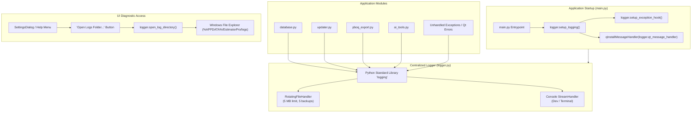

# Implementation Plan: Centralized Logging System for Estimator Pro

Estimator Pro is a PyQt6 desktop application distributed on Windows. In a packaged production environment (`.exe`), standard console output (`print()`, `sys.stderr`) is completely suppressed and invisible. A robust, centralized logging system is essential to ensure that application lifecycle events, database connections, background tasks, uncaught exceptions, and user-facing diagnostic tools work seamlessly.

---

## 1. Objectives & Architectural Requirements

1. **Persistent Diagnostics**: All logs are written to a rotating file on the local machine with detailed timestamps, log levels, module names, line numbers, and messages.
2. **Crash Interception (`sys.excepthook`)**: Any unhandled exception anywhere in the Python execution stack is trapped, recorded with full traceback, and cleanly logged before process termination.
3. **Qt Message Redirection**: Intercepts Qt framework warnings (`QtWarningMsg`, `QtCriticalMsg`, `QtFatalMsg`) and routes them through the standard Python `logging` pipeline while filtering harmless OS/theme noise.
4. **Log Rotation & Disk Protection**: Prevents unbounded log growth by using a `RotatingFileHandler` with file size limits (5 MB) and automated backup file rotation (5 historical backup files).
5. **Environment-Aware Log Paths**:
   - **Production (Frozen `.exe`)**: Saves to `%APPDATA%\EstimatorPro\logs\estimator.log` to avoid permission issues in `Program Files`.
   - **Development**: Saves to `./logs/estimator.log` relative to the workspace root.
6. **Support & User Accessibility**: Provides a simple UI mechanism in the **Settings** dialog allowing users to open the log directory with a single click.

---

## 2. System Architecture & Workflow



---

## 3. Directory & File Structure

```
Estimator_Pro_20May26/
├── logger.py                 # Centralized logging engine and helpers
├── main.py                   # Initializes logger on startup & sets Qt hook
├── settings_dialog.py        # Exposes 'Open Logs Folder' in App Settings
├── logs/                     # Local development log directory (auto-created)
│   ├── estimator.log         # Active log file
│   └── estimator.log.1       # Rotated historical logs
├── PyTest/
│   └── test_logger.py        # Automated test suite for logging system
└── MD Files/
    └── implementation_plan_logging.md # This document
```

---

## 4. Log Format & Levels

### Formatting Template
```text
%(asctime)s [%(levelname)s] [%(name)s:%(lineno)d] - %(message)s
```

*Example Log Entries:*
```text
2026-08-19 09:25:01,123 [INFO] [main:45] - Estimator Pro v1.0.1 starting up (Python 3.12.0 on win32)
2026-08-19 09:25:01,230 [INFO] [database:58] - Connected to database at C:\Users\User\AppData\Roaming\EstimatorPro\construction_costs.db
2026-08-19 09:25:02,450 [INFO] [updater:120] - Checking for updates via GitHub Releases API...
2026-08-19 09:25:03,110 [WARNING] [updater:145] - No active internet connection. Skipping remote update check.
2026-08-19 09:26:14,890 [ERROR] [pboq_export:215] - Failed to parse BOQ cell C14: ValueError('invalid literal for float')
2026-08-19 09:27:00,002 [CRITICAL] [logger:85] - Uncaught Exception: Traceback (most recent call last)...
```

### Log Levels Guide
| Level | Purpose in Estimator Pro | Example Usage |
| :--- | :--- | :--- |
| `DEBUG` | Detailed diagnostics for troubleshooting during development. | Raw SQL queries, HTTP payload dumps, coordinate calculations. |
| `INFO` | Significant milestones and normal application state transitions. | App launch, project opened, backup saved, BOQ exported, update available. |
| `WARNING` | Non-fatal anomalies or fallback paths. | Missing optional stylesheet, network timeout fallback, retry attempt #2. |
| `ERROR` | Operation failures that impact a feature but do not crash the app. | Excel import failure, formula parsing error, PDF generation error. |
| `CRITICAL` | Severe failures, corrupted databases, or uncaught application crashes. | Unhandled exceptions, database schema corruption, unrecoverable Qt fatals. |

---

## 5. Developer Usage Guide

### Getting a Logger in Any Module
In any file across the codebase, import `get_logger` and instantiate a module-level logger:

```python
# In any module (e.g. updater.py, database.py, pboq_export.py)
from logger import get_logger

logger = get_logger(__name__)

def perform_operation():
    logger.info("Starting operation...")
    try:
        # Code here
        logger.debug("Processing step 1 completed successfully.")
    except Exception as e:
        logger.error(f"Operation failed with error: {e}", exc_info=True)
        raise
```

Setting `exc_info=True` in `logger.error` automatically appends the complete stack trace to the log.

---

## 6. Integration Checklist

- [x] Create `logger.py` with `RotatingFileHandler`, cross-platform log directory resolution, uncaught exception handler, and Qt message router.
- [x] Integrate `setup_logging()`, `setup_exception_hook()`, and `qt_message_handler` into `main.py`.
- [x] Add **"Diagnostics & Logs"** button to `settings_dialog.py`.
- [x] Build comprehensive automated test suite in `PyTest/test_logger.py`.
- [x] Verify tests with `pytest`.
