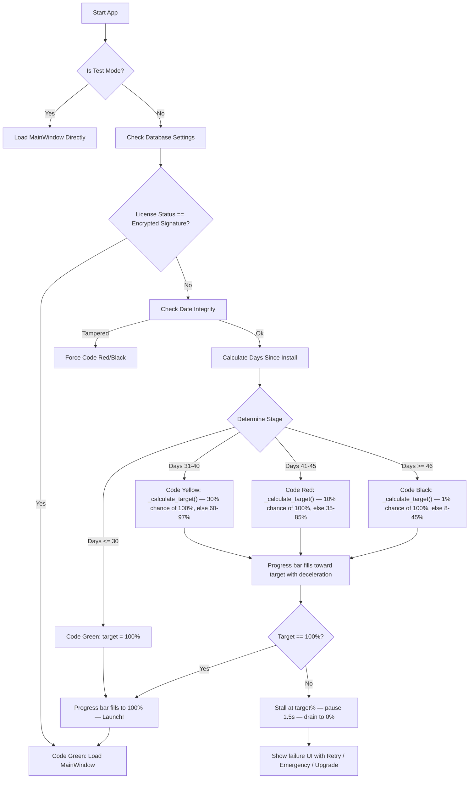

# Implementation Plan: Trial Gating Splash Screen (Code Green/Yellow/Red/Black)

This plan details the design and implementation for a **Trial Gating Splash Screen** in **Estimator Pro**. The gating mechanism uses a probabilistic trial degradation model (based on B.F. Skinner's operant conditioning and variable reinforcement schedules) to incentivize conversion from free to paid users within a 45-day window.

The launch mechanic uses a **gamified "slot-machine" progress bar** — the user watches a live percentage counter climb toward 100%. If the bar reaches 100%, the app launches. If it stalls short, it drains back to 0% and the user must try again or upgrade. This creates powerful near-miss psychology and retry compulsion.

> [!IMPORTANT]
> **Psychological Honesty Principle:** All messaging in this system uses a **Trial Pass / Fuel Gauge** metaphor — not fake network or server errors. Deceptive server-failure framing is a detectable lie (no network traffic occurs) that destroys user trust before conversion can happen. Skinner's conditioning only works when the organism cannot identify the mechanism as manipulative. The revised framing is honest, professional, and more effective.

---

## User Review Required

> [!IMPORTANT]
> **Probabilistic App Gating (Extinction Resistance):**
> * Instead of locking the user out completely after 30 days, we gate the **app startup process** itself on a probabilistic scale.
> * The probability roll is performed **upfront** via `_calculate_target()` before the progress animation begins. The result determines a **target percentage** — 100% on success (app launches), or a zone-weighted stall point on failure.
> * Users in Yellow Zone (Days 31-40) have a **30% chance** of reaching 100% — a **Variable Ratio Schedule**, the same schedule used by slot machines. On failure, the bar stalls between **60–97%** (tantalisingly close → "so close!" compulsion).
> * Users in Red Zone (Days 41-45) have a **10% chance** of reaching 100% — **Scarcity + Loss Aversion** framing. On failure, stalls between **35–85%**.
> * Users in Black Zone (Days 46+) have a **1% chance** — near-extinction state. On failure, stalls between **8–45%** (bar barely moves → reinforces "trial is over"). One-time **Emergency Pass** safety valve prevents review-damaging lockouts.
> * A **live percentage counter** (28pt bold label) and a **14px-tall progress bar** let the user watch every percentage point tick up, creating slot-machine tension.
> * **Deceleration effect:** In the last 10 ticks before a stall, the timer slows from 100ms → 150ms → 200ms → 300ms, creating a visceral "running out of steam" feel.
> * On failure, the bar **pauses for 1.5 seconds** at its stall point (e.g. "⏳ Stalled at 78%... launch slot lost"), then **drains back to 0%** before showing the failure UI with CTAs (Try Again / Emergency Pass / Upgrade).

> [!TIP]
> **Developer Testing Panel:**
> To make it easy for you to review and verify all 4 states, we will build a collapsible **Developer Panel** at the bottom of the splash screen. It will allow you to instantly switch the simulated trial stage, reset the trial, or shift the installation date backward.

---

## Proposed Changes

We will introduce a new module [trial_splash.py](file:///c:/Users/Consar-Kilpatrick/Estimator_Pro_20May26/estimator/trial_splash.py) and modify the application entry point [main.py](file:///c:/Users/Consar-Kilpatrick/Estimator_Pro_20May26/estimator/main.py).

---

### Gating Logic & Startup Flow

---

### Components

#### [NEW] [trial_splash.py](file:///c:/Users/Consar-Kilpatrick/Estimator_Pro_20May26/estimator/trial_splash.py)
This module defines the `TrialSplashDialog` class, inheriting from `QDialog`:
*   **Window Configuration:** Borderless frame (`Qt.WindowType.FramelessWindowHint`) with translucent background and drop shadow support. Base window height is 260px (increased from 210px to accommodate the percentage counter).
*   **Curated Aesthetics:** Curated color gradients matching the status code:
    *   **Green Zone:** Deep forest green and charcoal gradient with bright emerald highlights.
    *   **Yellow Zone:** Warm amber and charcoal gradient with bright gold highlights.
    *   **Red Zone:** Crimson red and dark charcoal gradient with rose highlights.
    *   **Black Zone:** Sleek carbon-fiber black gradient with dark slate and violet highlights.
*   **Honest Trial Pass Framing:** All messaging uses a **Trial Pass / Fuel Gauge** metaphor. No fake server or network-failure language is used anywhere — it is detectable (no network traffic occurs on a standalone desktop app) and destroys user trust before conversion.
*   **Gamified Slot-Machine Progress Bar:** The core launch mechanic is a visible, gamified progress bar:
    *   **`_calculate_target()`** — Called at init and on every reset. Performs the probability roll upfront and sets `target_val` (100 on success, a zone-weighted stall point on failure).
    *   **Live Percentage Counter (`pct_label`)** — A **28pt bold label** centered above the progress bar showing the live percentage ("0%" → "78%" → drain → "0%"). Colored with the zone's accent color.
    *   **Progress Bar** — **14px tall** (increased from 6px), `textVisible=False` (percentage shown in the separate label), with 7px border-radius for a rounded-pill look.
    *   **Fill Animation** — `update_progress()` increments `progress_val` toward `target_val` at 100ms ticks. Both the bar and the percentage label update in sync.
    *   **Deceleration Effect** — In the last 10 ticks before a stall, the timer interval progressively slows: 100ms → 150ms (≤10 remaining) → 200ms (≤6) → 300ms (≤3). Creates a visceral "running out of steam" sensation. Only applied to failures (`roll_success == False`).
    *   **Stall & Drain** — On reaching a non-100 target, the info label shows `"⏳ Stalled at {X}%... launch slot lost. Trial Pass — {Zone} Zone (100% required to launch)"`. After a **1.5-second pause** (`stall_paused` flag + `QTimer.singleShot`), `_start_rollback()` initiates the drain animation (decrement by 2 at 40ms intervals) back to 0%.
    *   **Success** — On reaching 100%, the percentage label shows "100%", the info label shows "✅ Launch successful!", and the dialog accepts after 900ms.
*   **Zone-Weighted Stall Points** (failure target ranges):
    *   **Yellow (30% success):** Stalls at **60–97%** — tantalisingly close → "so close!" retry compulsion.
    *   **Red (10% success):** Stalls at **35–85%** — varied range, sometimes hopeful.
    *   **Black (1% success):** Stalls at **8–45%** — bar barely moves → reinforces "trial is truly over".
    *   **Green (100% success):** Always 100% — guaranteed launch.
*   **Stage-Specific Skinnerian Copy:**
    *   **Green (Days 1–30):** Shows `Day X of 30 (Y days remaining)` — Fixed Interval awareness primes urgency *before* Yellow kicks in.
    *   **Yellow (Days 31–40, 30%):** `"Your Trial Pass is in the Yellow Zone — launches are no longer guaranteed. Upgrade for instant, guaranteed access every time."` — Variable Ratio framing, upgrade = certainty.
    *   **Red (Days 41–45, 10%):** `"Only 10% of trial launches succeed at this stage. Every day you wait is a bid you can't price."` — Loss Aversion framing.
    *   **Black (Days 46+, 1%):** `"Are you in the middle of an urgent bid? Use your one-time Emergency Pass, or upgrade for permanent access."` — Crisis relief → reciprocity obligation.
*   **Attempt Counter:** Tracks `trial_attempt_count` in the DB. On failure in Yellow/Red/Black, shows: `"You've attempted N launches this trial. Upgrade once — launch forever."` — Ratio fatigue framing.
*   **License Activation Dialog:** Clicking "Upgrade" opens the [LicenseActivationDialog](file:///c:/Users/Consar-Kilpatrick/Estimator_Pro_20May26/estimator/trial_splash.py#L62-L221) to enter and validate a timed license key (using the `XXXX-XXXXXX-XXXXXXXX-XXXXXXXX` format). On successful verification, the license details are saved to the database, granting a Green Pass.
*   **Emergency Pass Button:** Visible **only** in Black Zone. One-time use. Grants 24-hour access. Dialog copy makes reciprocity obligation explicit: `"Remember: this pass is one-time only and cannot be extended. Upgrade to a permanent Green Pass to never face this again."`
*   **`_reset_progress_state()`** — Centralised helper called by all dev-panel reset paths. Stops the timer, zeroes all animation state (`progress_val`, `rollback_phase`, `rollback_val`, `stall_paused`), resets the percentage label and bar to 0%, hides the failure buttons, re-rolls a fresh target via `_calculate_target()`, and restarts the timer at 100ms.
*   **Developer Panel (Testing Toolbar):** Hidden behind `Ctrl+Shift+Alt+D` + password prompt.
    *   Dropdown: `Auto (Date-based)`, `Force Green`, `Force Yellow`, `Force Red`, `Force Black`.
    *   Buttons: `Set Install to Day -35 (Yellow)`, `Set Install to Day -42 (Red)`, `Set Install to Day -50 (Black)`, `Reset Trial` (clears `install_date`, `license_status`, `emergency_bypass_date`, `last_run_date`, `trial_attempt_count`).

#### [MODIFY] [main.py](file:///c:/Users/Consar-Kilpatrick/Estimator_Pro_20May26/estimator/main.py)
We will integrate the splash screen before displaying `MainWindow`:
*   Import `TrialSplashDialog` and `DatabaseManager`.
*   **Test Environment Check:** Check if running in a pytest environment (e.g. searching `sys.modules` and inspecting `PYTEST_CURRENT_TEST` env). If yes, bypass splash screen to keep tests green.
*   **Database Access Guard:** Wrap startup database connection in a try-except block with 3 connection retries (500ms delay) to prevent lockout from Windows ghost processes. If connection completely fails, fallback to a safe **Code Green** trial state.
*   **Date Integrity Check:** Compare current date against database's `last_run_date`. If time went backward by more than 24 hours, flag a date-tamper state. Otherwise, update `last_run_date` to the current date.
*   Instantiate `TrialSplashDialog` and run `exec()`.
*   If the splash screen dialog accepts (returns `Accepted`), instantiate and show `MainWindow`.
*   If the dialog rejects (returns `Rejected`), exit the application process.

---

## Risk Mitigation Plan

### 1. Clock Manipulation Guard (Date-Tamper Protection)
*   **Risk:** Users changing their system clock backward to artificially extend Code Green/Yellow status.
*   **Mitigation:** The database will track `last_run_date`. To prevent false-positives when users change timezones or travel, we only trigger a clock-rollback lockout if `current_date < last_run_date - 1 day` (more than 24 hours difference). If rollback is detected, the app is restricted to **Code Red** or **Code Black** until corrected.

### 2. PyTest & CI Hang Prevention
*   **Risk:** Automated test runs getting blocked by interactive `exec()` dialogs, causing infinite hangs.
*   **Mitigation:** We implement a robust multi-point check in `main.py` looking for `pytest` and `_pytest` in `sys.modules` and inspecting `PYTEST_CURRENT_TEST` in environment variables.

### 3. Safe Startup Exception Handling (Locked Databases)
*   **Risk:** Application crashes if database is locked by another instance or file system access fails.
*   **Mitigation:** Database operations in `main.py` will be wrapped in try-except blocks. If a connection failure occurs, the app falls back to a safe **Code Green** state to prevent locking out legitimate paying users. Additionally, connection attempts will retry 3 times with a 500ms delay to accommodate quick restarts.

### 4. Memory and Threading Safety (Event Loop Cleanup)
*   **Risk:** Stray progress bar animation timers in the splash screen causing PyQt warnings or crashes upon transition to the main window.
*   **Mitigation:** All timers in the `TrialSplashDialog` will be explicitly terminated on dialog destruction.

### 5. Existing User Database Migration
*   **Risk:** Existing users updating the app won't have trial date rows in their settings database.
*   **Mitigation:** If the check fails to find `install_date`, we default to setting it to the **current date**, giving existing upgraders a fresh 30 days.

### 6. License Tamper Prevention (Basic DRM)
*   **Risk:** Users manually opening their SQLite database with external tools and writing `'Paid'` to the settings table.
*   **Mitigation:** We will store a hashed/encrypted signature (e.g., a hash of a constant combined with a secret salt) in `license_status` instead of a plain text string to prevent simple DB editor manipulation.

### 7. Support & Review Backlash Prevention (Emergency Valve)
*   **Risk:** A critical user blocked in Code Red/Black from finishing an urgent construction bid, causing support bottlenecks and 1-star reviews.
*   **Mitigation:** When a roll fails in the Code Black lane, we will provide a **"24-Hour Emergency Extension"** button. This grants a temporary 1-day launch pass to ensure business safety during deadlines, with a clear note that they must upgrade to permanent status afterward. The button is hidden in other lanes.

---

## Verification Plan

### Automated Tests
*   We will ensure the existing test suite continues to pass (39/39 tests) by bypassing the gating logic during testing environments.
*   Add verification assertions checking that `DatabaseManager` gets/sets settings correctly.

### Manual Verification
1.  **Launch the App:** Confirm that the splash screen loads first with the large percentage counter at "0%".
2.  **Verify Code Green (Days 1–30):** Select `Force Green` or set `Reset Trial`. The percentage counter should climb smoothly to **100%** and the app should auto-launch after a brief "✅ Launch successful!" message.
3.  **Verify Code Yellow (Days 31–40):** Toggle to `Force Yellow` or click the `-35 Days` button. Watch the bar:
    *   On **success (~30%):** Counter climbs to 100% → app launches.
    *   On **failure (~70%):** Counter climbs to a stall point between 60–97%, decelerates visibly in the last few ticks, pauses for ~1.5s showing "⏳ Stalled at X%... launch slot lost", then drains back to 0% before showing the failure UI.
4.  **Verify Code Red (Days 41–45):** Toggle to `Force Red` or click the `-42 Days` button. Observe the 10% success rate. On failure, stall points should range 35–85%.
5.  **Verify Code Black (Days 46+):** Toggle to `Force Black` or click the `-50 Days` button. Verify the 1% success rate. On failure, the bar should barely move (stall at 8–45%) before draining.
6.  **Verify Deceleration:** In Yellow/Red/Black failures, confirm that the progress bar visibly slows down in the final ~10 ticks before stalling — the "running out of steam" effect.
7.  **Verify Drain Animation:** After the 1.5s pause at the stall point, the bar and percentage counter should drain smoothly to 0% (decrement by 2 at 40ms intervals), then the failure UI (retry/upgrade/emergency buttons) should appear.
8.  **Verify License Activation:** Click "Upgrade" from any failed state, enter a valid unique license key (e.g. generated from [license_keygen.py](file:///c:/Users/Consar-Kilpatrick/Estimator_Pro_20May26/estimator/license_keygen.py)), verify that the validation succeeds, and confirm the app now opens immediately as a premium Paid License user.
9.  **Verify Emergency Valve:** Click the "24-Hour Emergency Extension" button in Code Black (confirming it is hidden/inaccessible in Green, Yellow, and Red lanes) and confirm it temporarily grants access and launches the main window.
10. **Verify Dev Panel Reset:** After a failed roll, open the dev panel and change the override or click Reset Trial. Confirm that the percentage label resets to "0%", the bar empties, a fresh target is rolled, and the animation restarts cleanly.
